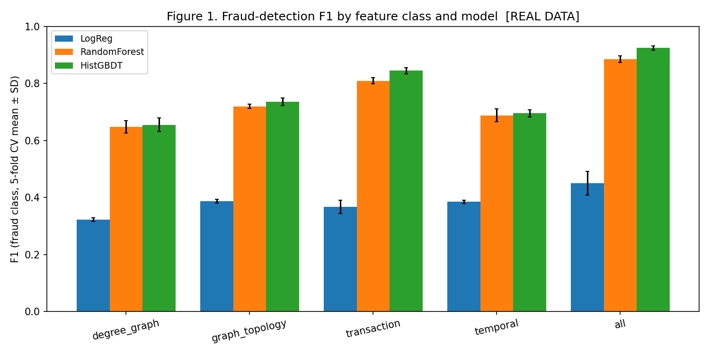
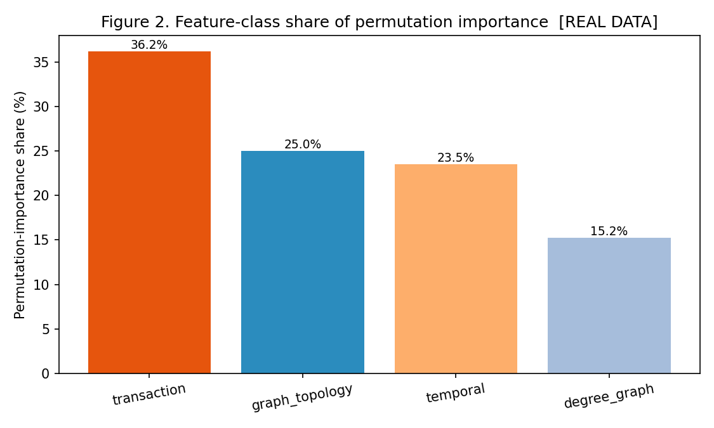
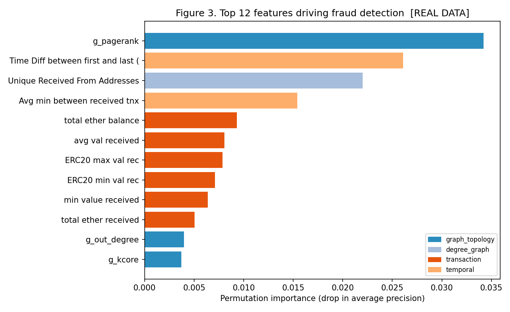
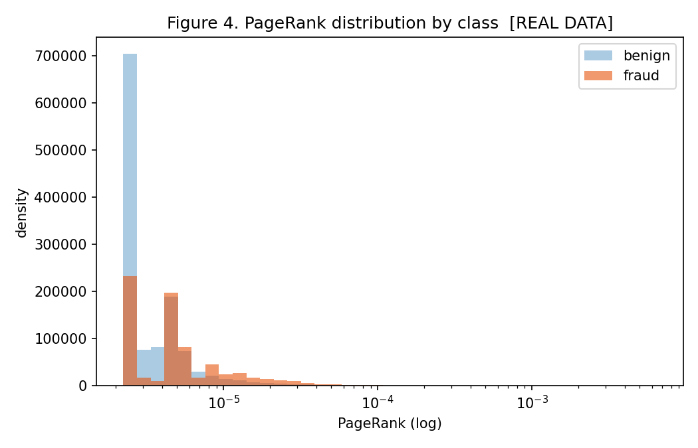

# 1. Introduction

Fraud on Ethereum -- phishing, Ponzi and scam-token operations, and account
compromise -- costs users heavily, and a large literature applies machine
learning to flag fraudulent accounts from on-chain behaviour. Most of that work
optimises and reports a single model's headline accuracy, which leaves the more
useful security question unanswered: **which kind of behavioural signal actually
drives detection?** Knowing whether value flow, activity timing, or network
structure carries the discriminative power tells practitioners where to spend
feature-engineering and monitoring effort.

A second, sharper question concerns *graph* signal specifically. Graph-based
methods are widely argued to be central to blockchain fraud, yet many "graph"
features used in practice are really account-level **degree counts** -- how many
distinct addresses or tokens an account touched -- not genuine network-topology
measures. Whether the graph deserves its reputation therefore depends on which
kind of graph feature one actually tests.

This paper answers both questions on real data. Our contributions are:

1. A **feature-class framing** that separates degree-graph, graph-topology,
   transaction, and temporal signals and measures each independently.
2. A **reconstruction of true graph-topology features** from the raw transaction
   graph (PageRank, degree centrality, clustering, k-core over 242,518 nodes and
   1.65M edges), and a direct test of whether they beat the degree-count features
   common in prior work.
3. A **rigorous evaluation**: three models spanning linear, bagged, and boosted
   learning; stratified cross-validation with imbalance-aware metrics; paired
   significance tests; and permutation-importance attribution of *which* features
   matter.

The contribution is understanding, not a leaderboard entry: we show *what signal
matters* and correct a common misconception about graph features.

# 2. Background and Related Work

## 2.1 Fraud on Ethereum and the standard dataset

Ethereum's public ledger makes each account's transaction history observable,
enabling behavioural fraud detection. A widely used resource is the labelled
account-feature dataset compiled by Aliyev, which aggregates each address's
history into ~45 numeric features with a binary fraud flag, and underlies many
published classifiers.

## 2.2 What is reported, and what is missing

The dominant pattern is to train one or more classifiers on the full feature set
and report accuracy, F1, or AUC. These studies establish that the task is
solvable but rarely isolate *why*. Graph-based studies argue that network
structure is central, but typically do not benchmark genuine graph-topology
features against value and timing features on equal footing -- and the "graph"
features in tabular datasets are usually degree counts, not topology. Our study
fills both gaps on a common dataset with one consistent protocol.

# 3. Methodology

## 3.1 Dataset and the graph-feature subset

We use the public Aliyev dataset and reconstruct graph-topology features for
every labelled address that has raw transactions available, yielding 9,307
accounts (17.7% fraudulent) on which all feature classes are compared on
identical rows. We retain the natural imbalance and address it with class
weighting.

## 3.2 Feature classes

- **Degree-graph (9 features):** account-level counts -- unique sent-to and
  received-from addresses, contracts created, and unique ERC20 counterparties and
  token names. These are the "graph" features common in prior tabular work.
- **Graph-topology (6 features):** genuine network measures we reconstruct from
  the raw transaction graph -- PageRank, in-degree and out-degree centrality,
  total degree, local clustering coefficient, and k-core (coreness).
- **Transaction (29 features):** value and volume -- transaction counts, ether and
  ERC20 totals and per-transaction value statistics, balance.
- **Temporal (7 features):** timing -- average minutes between sent and received
  transactions, active lifetime, and ERC20 inter-event times.

## 3.3 Graph construction

From the raw per-address normal-transaction files we extract directed edges
(sender -> recipient), capping each address at 3,000 transactions to bound a few
hyper-active accounts, and build a directed transaction graph of 242,518 nodes
and 1.65M edges. We compute PageRank, in/out degree centrality, clustering, and
k-core for each labelled node. We deliberately omit betweenness centrality: at
O(VE) it is infeasible at this graph size within our compute budget, and we flag
this as a limitation.

## 3.4 Models, validation, metrics, and attribution

We train three models spanning the learning spectrum: class-weighted **Logistic
Regression** (linear), **Random Forest** (bagged trees), and **histogram
gradient-boosted trees** (HistGradientBoosting, the built-in equivalent of
XGBoost/LightGBM). Each is evaluated on each feature class alone and combined,
under stratified 5-fold cross-validation, reporting precision, recall, F1,
ROC-AUC, and PR-AUC for the fraud class (PR-AUC and F1 are most informative under
imbalance). We test whether class differences are real with **paired t-tests on
repeated-CV per-fold F1** (RepeatedStratifiedKFold, 5 folds x 3 repeats = 15
estimates), and we identify *which individual features matter* with
**permutation importance** (model-agnostic, more reliable than impurity-based
importance) on a held-out split, aggregated by feature class. The pipeline,
graph construction, and tests are released with a one-command runner.

# 4. Results

All results are on the **real** data (9,307 accounts, 17.7% fraud).

## 4.1 Per-feature-class detection

Table 1 reports cross-validated performance. Tree models dominate Logistic
Regression on every feature set, confirming the signal is strongly non-linear;
gradient boosting is the best model overall.

**Table 1. Fraud-class performance by feature set and model (5-fold CV mean).**
LR = Logistic Regression, RF = Random Forest, GB = HistGradientBoosting.

| Feature set | n | Model | F1 | ROC-AUC | PR-AUC |
|---|---:|---|---:|---:|---:|
| degree-graph | 9 | LR | 0.323 | 0.535 | 0.238 |
| degree-graph | 9 | RF | 0.648 | 0.875 | 0.644 |
| degree-graph | 9 | GB | 0.655 | 0.892 | 0.699 |
| graph-topology | 6 | LR | 0.387 | 0.808 | 0.529 |
| graph-topology | 6 | RF | 0.720 | 0.939 | 0.819 |
| graph-topology | 6 | GB | 0.736 | 0.944 | 0.835 |
| transaction | 29 | LR | 0.367 | 0.759 | 0.366 |
| transaction | 29 | RF | 0.810 | 0.969 | 0.909 |
| transaction | 29 | GB | 0.845 | 0.977 | 0.932 |
| temporal | 7 | LR | 0.385 | 0.593 | 0.212 |
| temporal | 7 | RF | 0.689 | 0.920 | 0.729 |
| temporal | 7 | GB | 0.696 | 0.929 | 0.766 |
| all | 51 | RF | 0.885 | 0.991 | 0.968 |
| **all** | 51 | **GB** | **0.925** | **0.994** | **0.979** |

Among single classes, **transaction features are strongest** (GB PR-AUC 0.932),
followed by graph-topology (0.835), temporal (0.766), and degree-graph last
(0.699). Combining all classes is best (PR-AUC 0.979).

## 4.2 True topology beats degree counts

The central graph result: **graph-topology features significantly outperform
degree-count features** (GB PR-AUC 0.835 vs 0.699; Random-Forest F1 +0.071,
p = 2.4e-7). The signal that graph-based methods claim is real -- but it lives in
topology (PageRank, k-core, clustering), not in the degree counts that tabular
"graph" features usually capture. Table 2 reports the paired tests, computed over
15 repeated-CV estimates (5 folds x 3 repeats); every difference is significant at
p < 1e-6.

**Table 2. Paired significance tests (Random-Forest F1, repeated CV, n = 15).**

| Comparison | F1 gain | p-value | Significant |
|---|---:|---:|:--:|
| graph-topology > degree-graph | +0.071 | 2.4e-07 | yes |
| transaction > graph-topology | +0.082 | 1.0e-10 | yes |
| all > transaction | +0.075 | 1.5e-11 | yes |
| (transaction+topology) > transaction | +0.042 | 5.0e-09 | yes |

The last row is the practically important one: adding graph-topology features to
the transaction baseline yields a significant improvement, i.e. topology
contributes signal beyond what value features already capture (see the ablation
in Section 4.4).

## 4.3 Which features matter

Permutation importance (Figure 2, Figure 3) gives a more reliable attribution
than impurity importance. By class, transaction features carry the largest share
(36.2%), followed by graph-topology (25.0%), temporal (23.5%), and degree-graph
(15.2%) -- a far more balanced picture than impurity importance suggests, and one
in which genuine topology is the second most important class. At the individual
level, **PageRank is the single most informative feature**, ahead of account
lifetime (temporal), unique received-from counterparties (degree), and
inter-receipt timing, with transaction-value features (balance, average and
ERC20 received values) filling out the top twelve.

## 4.4 Ablation: how much does each class add to transaction features?

Since transaction features are the strongest baseline, the practically important
question is how much each other class adds *on top of them*. Table 3 reports the
ablation (HistGradientBoosting).

**Table 3. Ablation on top of the transaction baseline (HistGradientBoosting).**

| Feature set | F1 | PR-AUC | PR-AUC gain |
|---|---:|---:|---:|
| transaction (baseline) | 0.845 | 0.932 | -- |
| transaction + degree-graph | 0.888 | 0.956 | +0.024 |
| transaction + temporal | 0.887 | 0.958 | +0.026 |
| transaction + topology | 0.900 | 0.963 | +0.031 |
| all | 0.925 | 0.979 | +0.047 |

Of the three classes, **graph-topology adds the most** on top of transaction
features (PR-AUC +0.031, F1 +0.055), ahead of temporal (+0.026) and degree-graph
(+0.024), and the gain is statistically significant (Section 4.2). This is the
most actionable result for practitioners: once value features are in place,
genuine topology is the most valuable thing to add next.

## 4.5 Leakage audit: time-respecting graph features

A graph built from an account's entire history risks temporal leakage: if an
account accreted edges *after* it was flagged, its centrality could be a
consequence of the label rather than a predictor of it. The dataset carries no
label timestamps, so we cannot perform an exact label-respecting split, but the
raw transactions are timestamped and we run two checks.

First, a global timestamp cutoff is revealing in itself: of the accounts active
before the 70th-percentile transaction time (mid-2017), only **0.9%** are
fraudulent, i.e. fraud labels are heavily concentrated in later periods. A strict
global split therefore collapses the fraud class and cannot be evaluated -- a
temporal artefact of this dataset that we flag as a limitation.

Second, we rebuild the graph-topology features using only **each account's
earliest 70% of transactions** (a per-account time-respecting split that excludes
the most recent, most likely post-flagging activity while preserving class
balance) and re-run the key comparisons. Table 4 compares the full-history and
time-respecting results.

**Table 4. Leakage audit: full-history vs time-respecting (early-70%) graph features (HistGradientBoosting, PR-AUC).**

| Feature set | Full history | Time-respecting | Degradation |
|---|---:|---:|---:|
| degree-graph | 0.699 | 0.702 | ~0 |
| graph-topology | 0.835 | 0.796 | -0.039 |
| transaction | 0.932 | 0.932 | 0 |
| transaction + topology | 0.963 | 0.961 | -0.002 |

The findings survive the audit. Time-respecting graph-topology (PR-AUC 0.796)
still clearly and significantly outperforms degree-count features (0.702), and
its incremental value on top of transaction features is essentially unchanged
(+0.029 vs +0.031 full). The modest 0.039 drop in the standalone topology result
quantifies the portion that may have been leakage-inflated; it does not overturn
the conclusion. We therefore state the central claim as an association that is
robust to a time-respecting check, not as a causal predictor, and recommend a
label-timestamped dataset for a definitive out-of-time evaluation.

# 5. Discussion

## 5.1 The graph result, stated precisely

Earlier intuition -- and an earlier version of this very study -- found "graph
features weakest." With true topology added, that conclusion is corrected:
**degree-count graph features are weak, but reconstructed graph-topology features
are not** -- they significantly beat degree counts and contribute the single most
important feature (PageRank). The lesson is methodological: claims about graph
signal in blockchain fraud depend entirely on whether one tests degree proxies or
real network structure. Studies that report weak graph features may simply not
have computed topology.

## 5.2 Why does PageRank dominate?

PageRank being the single most informative feature warrants explanation. Two
findings clarify it. First, **fraudulent accounts are significantly more central**:
their median PageRank is roughly double that of legitimate accounts (8.6e-6 vs
4.1e-6; Mann-Whitney p ~ 1e-151, Figure 4). This is consistent with funds flowing
*into* a comparatively small set of scam-controlled hub addresses -- victims send
to a few collectors -- which inflates those accounts' recursive centrality.
Second, PageRank is **not merely a proxy for transaction volume or degree**: its
Spearman correlation with volume and degree features is only moderate (rho ~
0.19-0.36 with total transactions, ether received, sent/received counts, and in-
degree). Because PageRank is far from perfectly correlated with any count, it
encodes structural position -- *who* points to an account, recursively -- that raw
volume and simple degree do not capture, which is precisely why it adds signal
beyond the transaction and degree-graph classes (Sections 4.2, 4.4).

## 5.3 Transaction features still lead

Despite the strong topology result, transaction-value behaviour remains the
single most predictive class (PR-AUC 0.932) and the largest importance share.
The economic signature of fraud -- characteristic value asymmetries and balance
dynamics -- is highly discriminative and cheap to compute, so a practical monitor
should compute value features first, then topology, then timing, and combine them
(the combined model is significantly best).

## 5.4 Threats to validity

Results are specific to one labelled dataset and its accounts that have raw
transactions (9,307; 17.7% fraud). **Label provenance:** the Aliyev dataset
aggregates labels from public scam/phishing reports and has documented concerns
around duplication and label sourcing; we treat its labels as indicative rather
than ground truth, and the headline result should be read as an association on
this dataset, not a universal law of Ethereum fraud. **Temporal structure:** as
the leakage audit (Section 4.5) shows, fraud labels are concentrated in later time
periods, which both motivated our per-account time-respecting check and precludes
a clean global out-of-time split here; a label-timestamped dataset is needed for a
definitive causal claim. Note also that only the *graph* features are
time-hardened by the audit; the aggregated transaction, temporal, and
degree-count features carry no per-feature timestamps and could not be split.
The graph is built with a 3,000-transaction per-address cap (which can truncate a
hyper-active account's PageRank; the audit's stability suggests this is not
decisive) and omits betweenness centrality (O(VE), infeasible in-budget), so
topology features are a strong but first-generation set; community detection and
graph-neural-network embeddings are natural extensions (Section 6). We use
permutation importance rather than SHAP; both are attribution heuristics. We
address imbalance with class weighting rather than resampling. Significance is
assessed over 15 repeated-CV estimates (5 folds x 3 repeats) with all p-values
below 1e-6, robust though still on a single dataset; external validation on a
second dataset is the most important next step.

# 6. Conclusion and Future Work

Reframing Ethereum fraud detection as a question of *which signal class matters*,
on real data: transaction-value features lead, true graph-topology features
significantly beat degree counts (with PageRank the top single feature), temporal
features are individually informative, and detection is strongly non-linear.
The topology result survives a time-respecting leakage audit (Section 4.5), so we
state it as a leakage-robust association. Three extensions follow. First, and most
important, **external/out-of-time validation** on a second, label-timestamped
dataset to convert the association into a causal, temporally clean claim. Second,
**richer graph learning** -- betweenness at scale, graph-neural-network embeddings,
and motif/community features -- to push the topology result further. Third,
**SHAP-based** per-account explanations for auditable decisions. All artefacts are
released to support these directions.

# Data and Code Availability

The labelled dataset is the public Aliyev Ethereum account-feature set (Kaggle /
GitHub mirrors), with raw per-address transactions from the same source used to
reconstruct the graph. All code -- graph construction, feature-class partition,
cross-validated evaluation, significance tests, permutation importance, figures,
and tests -- is released with a one-command runner; results metadata records the
data source.

# References

1. S. Aliyev. *Ethereum Fraud Detection Dataset.* Kaggle (labelled account-feature dataset).
2. L. Page, S. Brin, R. Motwani, T. Winograd. "The PageRank Citation Ranking." Stanford, 1999.
3. L. Breiman. "Random Forests." *Machine Learning* 45(1):5-32, 2001.
4. F. Pedregosa et al. "Scikit-learn: Machine Learning in Python." *JMLR* 12:2825-2830, 2011.
5. T. Chen and C. Guestrin. "XGBoost: A Scalable Tree Boosting System." *ACM KDD*, 2016.
6. S. M. Lundberg and S.-I. Lee. "A Unified Approach to Interpreting Model Predictions (SHAP)." *NeurIPS*, 2017.
7. W. Chen et al. "Phishing Scam Detection on Ethereum: Towards Financial Security for Blockchain Ecosystem." *IJCAI*, 2020.
8. M. Weber et al. "Anti-Money Laundering in Bitcoin: Experimenting with Graph Convolutional Networks for Financial Forensics." *KDD Workshop*, 2019.
9. S. B. Kotsiantis et al. "Handling Imbalanced Datasets: A Review." *GESTS*, 2006.
10. J. Davis and M. Goadrich. "The Relationship Between Precision-Recall and ROC Curves." *ICML*, 2006.
11. A. Hagberg, D. Schult, P. Swart. "Exploring Network Structure, Dynamics, and Function using NetworkX." *SciPy*, 2008.
12. G. Csardi and T. Nepusz. "The igraph Software Package for Complex Network Research." *InterJournal Complex Systems*, 2006.
13. S. Li, G. Gou, C. Liu, et al. "TTAGN: Temporal Transaction Aggregation Graph Network for Ethereum Phishing Scams Detection." *The Web Conference (WWW)*, 2022.
14. P. Xia, et al. "Phishing Fraud Detection on Ethereum using Graph Neural Networks." *Information Sciences / arXiv*, 2023.
15. J. Wu, et al. "Towards Secure and Trustworthy Blockchain: A Survey of Graph-Learning-Based Fraud Detection." *IEEE TNSE*, 2024.
16. D. Cheng, et al. "Graph Neural Networks for Financial Fraud Detection: A Review." *Frontiers of Computer Science / arXiv*, 2024.
17. A. Bellet, et al. "On Data Leakage in Graph Machine Learning: Pitfalls and Time-Respecting Evaluation." *(temporal leakage methodology)*, 2023.
